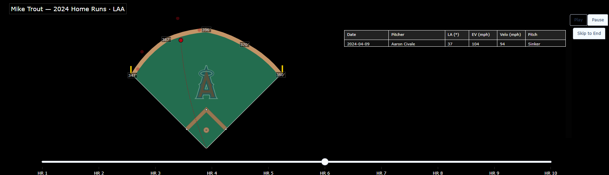

# Interactive Home Run Spray Chart

An interactive visualization tool that generates **animated spray
charts** for MLB players' home runs across the 2018--2024 seasons. Built
with Python, [pybaseball](https://github.com/jldbc/pybaseball), and
[Plotly](https://plotly.com/python/).

## Features

-   Enter any MLB player and season (2018--2024) to analyze.\
-   Fetches Statcast data automatically.\
-   Creates an **animated spray chart** showing all the player's home
    runs.\
-   Interactive playback: pause, skip, or jump to a specific home run.\
-   Displays key details for each HR:
    -   Date\
    -   Pitcher\
    -   Launch angle\
    -   Exit velocity\
    -   Pitch velocity\
    -   Pitch type

## How to Use

1.  Open the notebook in [Google
    Colab](https://colab.research.google.com/) (or locally in Jupyter).\
2.  Enter the player's name.\
3.  Choose the season to analyze.\
4.  Click **Run All**.\
5.  Scroll down to watch the **spray chart animation**.

You can:\
- Hit **Pause** to stop playback.\
- Hit **Skip to End** to jump ahead.\
- Click individual home runs on the slider to explore details.\
- Hover over the **brightest dot** in the chart to see info on that
specific home run.


## Requirements

-   Python 3.8+\
-   `pybaseball`\
-   `plotly`\
-   `numpy`, `pandas`

Install dependencies:

``` bash
pip install pybaseball plotly numpy pandas
```

## Repository Structure

    .
    ├── Interactive_HR_Spray_Chart.ipynb   # Main notebook
    ├── mlb_vis_core.py                     # Core plotting + utility functions
    └── README.md                           # Project documentation

## Open in Colab

You can try it directly in Colab without cloning:

[](https://colab.research.google.com/github/trevordshepherd/Interactive-Home-Run-Spray-Chart---trevordshepherd/blob/main/Interactive_HR_Spray_Chart.ipynb)

Here’s an example of what the interactive chart looks like:




## Credits
- Project author: **Trevor Shepherd** ([@trevordshepherd](https://github.com/trevordshepherd))


-   Project Author: Trevor Shepherd
    ([@trevordshepherd](https://github.com/trevordshepherd))\
-   Data provided by
    [Statcast](https://baseballsavant.mlb.com/statcast_search).\
-   Python tools via [pybaseball](https://github.com/jldbc/pybaseball).\
-   Visualization powered by [Plotly](https://plotly.com/).
